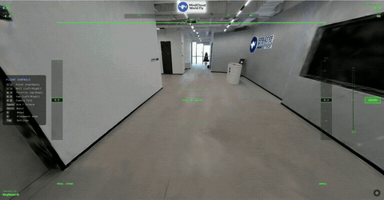

# MindCloud World Fly

<p align="center">
  
</p>

<p align="center">
  
</p>

<p align="center">
  
</p>

<p align="center">
  
</p>

A browser-based drone flight simulator for 3D Gaussian Splatting scenes. Fly through any 3DGS scene with realistic physics, FPV or stabilized drone controls, and RC transmitter support.

## About Manifold Tech

[Manifold Tech Ltd.](https://manifoldtech.cn) builds tools and infrastructure for spatial intelligence. We focus on 3D reconstruction, scene understanding, and embodied AI — bridging the gap between real-world capture and interactive simulation.

Manifold Tech's hardware products — including the **Q9000**, **Pocket 2 / 2 Pro**, and **Odin 1** — can capture high-quality 3D Gaussian Splatting models of real-world environments. These 3DGS scenes can then be loaded directly into MindCloud World Fly as flyable environments, enabling realistic drone flight simulation through your own scanned spaces.

## Quick Start

```bash
# First-time setup (run once as root for HID device permissions):
sudo bash setup_udev.sh

# Launch everything (HTTP server + WebHID bridge + browser):
./launch.sh          # Firefox + NVIDIA GPU (recommended)
./launch.sh chrome   # Chrome + Intel GPU (native WebHID)
```

Or start the HTTP server manually:

```bash
python3 serve.py
```

Open **http://localhost:8080** in your browser (Chrome/Edge recommended for native Gamepad API; Firefox supported via WebHID bridge).

## Supported Formats

| Format | Extension | Description |
|--------|-----------|-------------|
| PLY    | `.ply`    | Standard 3DGS point cloud |
| SPLAT  | `.splat`  | Compressed splat format (auto-converted to PLY for rendering) |
| SOG    | `.sog`    | Compressed archive format (always Y-up) |

Drag and drop a file onto the page, or click **Choose File** to browse.

## Demo Scenes

Two ready-to-fly demo scenes are available on Google Drive. Both were captured using Manifold Tech hardware and reconstructed as 3D Gaussian Splatting models of real-world environments. Download a `.sog` file, then drag and drop it onto the page to start flying immediately.

### Field (Z-up)

<p align="center">
  
</p>

[**field_z-up.sog**](https://drive.google.com/file/d/11yztizITalnHwnichd4iXHVaQbMYplTD/view?usp=sharing) — an outdoor field environment. This scene uses the **Z-up** coordinate system, so select **Z-up** in the coordinate system dropdown during the filter step.

### Nanjing

<p align="center">
  
</p>

[**nanjing.sog**](https://drive.google.com/file/d/1ft5q-ALGwFB3hp44vt648kdYUoNi_S9f/view?usp=sharing) — an urban scene captured in Nanjing, China.

## User Guide

### Step 1: Load a Scene

1. Open the app in your browser at **http://localhost:8080**
2. **Drag and drop** a `.ply`, `.splat`, or `.sog` file onto the page, or click **Choose File**
3. Wait for parsing and engine initialization (progress shown on screen)

### Step 2: Filter the Scene

After loading, you enter the **Filter** stage with an orbit camera view of the full scene:

- **Distance** slider — crop points beyond a radius from the scene centroid (removes outliers and sky noise)
- **Opacity** slider — hide low-opacity Gaussians (cleans up semi-transparent artifacts)
- **Up Axis** selector — choose **Z-Up** or **Y-Up** to match your scene's coordinate system. The preview updates live as you switch. For `.sog` files this is auto-set to Y-Up and hidden.
- **Point count** is displayed in real time as you adjust sliders

Camera controls during filtering:
- **Left-drag** to orbit
- **Scroll** to zoom

Click **Apply** when satisfied. The chosen coordinate system is locked and shown (read-only) in the settings panel.

> **Tip:** If the scene appears sideways or upside down, you likely have the wrong Up Axis. Press **Esc** to exit and reload the file with the correct setting.

### Step 3: Place the Drone

After filtering, you enter **Placement Mode**:

| Control | Action |
|---------|--------|
| W / S | Move drone forward / back (relative to camera view) |
| A / D | Move drone left / right |
| Q / E | Move drone down / up |
| Left-drag | Orbit camera around drone |
| Scroll | Zoom in / out |
| Enter | Confirm placement and start flying |
| Esc | Exit scene (with confirmation) |

A blue marker shows the drone's spawn position. The camera orbits around it as you move.

### Step 4: Fly

Press **Enter** to confirm placement. The view switches to the drone's onboard camera.

**Before you can fly, you must arm the drone:**
- Press **Space** on keyboard, or
- Press the assigned arm button on your controller

The status indicator at the bottom of the screen shows **ARMED** (green) or **DISARMED** (red).

### Flight Controls (Keyboard)

| Key | Action |
|-----|--------|
| W / S | Throttle up / down |
| A / D | Yaw left / right |
| ↑ / ↓ | Pitch forward / back |
| ← / → | Roll left / right |
| Q / E | Camera tilt up / down (drone mode) |
| Space | Arm / disarm toggle |
| R | Reset drone to spawn point |
| M | Toggle flight mode (FPV ↔ Drone) |
| Shift | Boost (1.5× thrust) |
| P | Return to placement mode (reposition drone) |
| Tab | Open settings panel |
| Esc | Close settings panel, or exit scene |

### Flight Controls (RC Transmitter)

Connect your RC transmitter via USB. It is detected via the browser Gamepad API or the WebHID bridge (for browsers like Firefox that lack native WebHID support).

To connect via WebHID bridge:
1. Open settings (**Tab**)
2. Check **Disable Gamepad API (for WebHID)**
3. Click **Connect HID Device** and select your transmitter
4. Run calibration if prompted

Default channel mapping (AETR):

| Axis | Action |
|------|--------|
| 0 | Roll |
| 1 | Pitch |
| 2 | Throttle |
| 3 | Yaw |
| Button 0 | Arm toggle (gamepad button; assignable) |
| (assignable) | Flight-mode switch (any button or channel) |

Reset is keyboard-only (press **R**); it has no RC / gamepad binding.

### Flight Modes

| Mode | Behavior |
|------|----------|
| **Drone (Easy)** | Stabilized flight with position and altitude hold. Sticks command velocity — release to hover. Yaw stick commands yaw rate; release simply stops the turn, so the drone keeps whatever heading it had. Cascaded PID controller keeps the drone level and on target. Best for exploration. |
| **FPV (Manual)** | Direct rate control — sticks map to body-frame angular rates (pitch, roll, yaw). No self-leveling. Throttle directly controls thrust. Requires constant pilot input. Realistic FPV experience. |

Switch modes at any time by pressing **M**, by mapping an RC channel to the **Mode Switch** action in the settings panel, or by using the dropdown in the settings panel (**Tab**). An RC binding can be configured as either **Toggle** (a flick flips the mode, like a momentary button) or **Level** (switch-up = FPV, switch-down = Drone — the channel position *is* the mode). Switching from FPV to Drone levels roll and pitch while preserving the current heading. Each mode stores its own independent set of **PID gains** and **Rate/Expo** parameters, so tuning one mode does not affect the other.

**Drone mode** uses a fixed camera tilt angle (set in settings, 0–60°). **FPV mode** uses a fixed mount angle during flight; adjust Q/E before arming, or set it in settings.

### HUD & OSD

During flight, the screen displays:

- **HUD (corners):** altitude, vertical speed, ground speed, FPS, controller status, armed state
- **OSD (center overlay):** artificial horizon with pitch ladder, heading compass, altitude and speed tapes, vertical speed indicator, flight mode label
- **Collision warning:** screen flashes red and shows "COLLISION" text on impact

The FPV OSD overlay can be toggled on/off in settings (Display → FPV OSD Overlay).

### Settings Panel

Press **Tab** to open. Sections:

- **Display** — Clean Mode (hides logo and key guide only; HUD and OSD remain visible), FPV OSD toggle
- **RC Channel Assignment** — assign and invert axes, set dead zones (default 0), with listen-mode auto-detect
- **Button Assignment** — assign **Arm** and **Mode Switch** to a gamepad button or an RC channel. Each axis binding has an **Inv** toggle (flip which end counts as active) and a **Toggle / Level** trigger dropdown. Reset is keyboard-only.
- **Rates & Expo** — per-axis rate multiplier and expo curve (stored independently per flight mode)
- **Audio** — independent **Mute** checkbox + volume slider for **Engine Sound** and **Background Music**. Ticking Mute snaps the slider to 0 (remembering the previous position); un-ticking restores it. Dragging the slider to 0 auto-ticks Mute; dragging above 0 auto-unticks it. BGM cycles `asset/music/initializ.flac` during loading / filtering / placement and shuffles `playing1.flac` / `playing2.flac` (+ any `playing3.flac`, `playing4.flac`, … you add to `BGM_PLAYLISTS` in `src/main.js`) during flight.
- **Gamepad Status** — shows connected controller name; option to disable Gamepad API for WebHID
- **Channel Monitor** — real-time axis values from the gamepad
- **Coordinate System** — shows the Up Axis chosen during filtering (read-only)
- **Flight Mode** — switch between Drone (Easy) and FPV (Manual); parameters swap automatically
- **Camera** — horizontal FOV, FPV mount angle (0–60°)
- **Controller Gains** — tune Pos Kp/Ki/Kd, Vel Kp/Ki/Kd, Alt Kp/Ki/Kd with number inputs (stored independently per flight mode)
- **Physics** — mass, max thrust, drag Cd, frontal area, drone size, collision radius
- **Export / Import** — save or load full configuration as JSON (includes both flight mode parameter sets)

All settings persist automatically in `localStorage`.

### Remapping Controls

1. Press **Tab** to open settings
2. Click **Assign** next to any axis or button action
3. Move the stick or press the button on your transmitter
4. Use **Invert** checkbox if axis direction is reversed
5. Adjust **Dead Zone** sliders as needed (default is 0)

You can also **Export** / **Import** full configs as JSON files to share between browsers or back up your setup.

## Physics

Quaternion-based orientation with body-frame rotations. Thrust along local up axis, quadratic aerodynamic drag, and gravity.

| Parameter | Default | Description |
|-----------|---------|-------------|
| Mass | 500 g | Drone mass |
| Max Thrust | 1000 gf | Maximum thrust force |
| Drag Cd | 1.0 | Drag coefficient |
| Frontal Area | 0.01 m² | Reference area for drag |
| Drone Size | 0.3 m | Width/depth of drone body |
| Collision Radius | 0.3 m | Bounding sphere for collision |
| Gravity | 9.81 m/s² | Fixed |

All parameters (including controller PI gains) are adjustable live in the settings panel.

## Collision

Gaussian center positions are filtered by distance and opacity, then built into an octree spatial index. On collision:
- Drone is pushed out along the estimated surface normal
- Velocity is reflected and dampened
- Screen flashes red + HUD shows collision warning

## Project Structure

```
├── index.html              # UI layout and styles
├── serve.py                # Simple HTTP dev server (CORS + ES module headers)
├── launch.sh               # One-click launcher (HTTP server + WebHID bridge + browser)
├── hid_server.py           # WebHID bridge server (ws://localhost:8766)
├── setup_udev.sh           # udev rules for non-root HID device access
├── .gitignore              # Excludes scene/, raw audio source, and tools/
├── src/
│   ├── main.js             # App init, scene loading, game loop
│   ├── controller.js       # Keyboard + gamepad + WebHID input, per-mode settings UI
│   ├── drone.js            # Quaternion physics, FPV/drone control laws, PID controller
│   ├── collision.js        # Octree spatial index + collision response
│   ├── hud.js              # Head-up display overlay
│   ├── osd.js              # On-screen display (artificial horizon, telemetry)
│   ├── audio.js            # FPV engine sound (sample playback + throttle-modulated rate)
│   ├── bgm.js              # Playlist-based background music (FLAC tracks from asset/music/)
│   ├── webhid_polyfill.js  # WebHID API polyfill for Firefox (proxies via hid_server.py)
│   ├── ply-parser.js       # PLY format parser + NaN/Inf sanitizer
│   ├── splat-parser.js     # SPLAT format parser + PLY converter
│   └── sog-parser.js       # SOG format parser
├── scene/                  # Scene files (gitignored, not tracked)
├── asset/
│   ├── display/             # Images + gifs used by index.html / README
│   │   ├── logo.png
│   │   ├── mt_mcwf_logo.jpg
│   │   ├── demo_flight.gif
│   │   ├── demo_field.gif
│   │   ├── demo_nanjing.gif
│   │   ├── demo_teaser.jpg
│   │   └── demo_teaser2.jpg
│   └── music/               # Audio assets (engine sound + BGM tracks)
│       ├── fpv_loop.wav       # Looped FPV engine audio (pre-processed)
│       ├── initializ.flac     # BGM for loading / filtering / placement
│       ├── playing1.flac      # BGM cycled during flight (add playing3/4/5 etc.)
│       └── playing2.flac
├── LICENSE                 # Apache 2.0
└── NOTICE                  # Third-party attributions
```

## Dependencies

| Library | Version | License | Usage |
|---------|---------|---------|-------|
| [PlayCanvas](https://github.com/playcanvas/engine) | 2.17.2 | MIT | 3D engine, GSplat rendering |
| [JSZip](https://github.com/Stuk/jszip) | 3.10.1 | MIT | SOG file decompression |

Both loaded via CDN — no build step or `npm install` required.

## Requirements

- Modern browser with WebGL2 (Chrome, Edge, Firefox)
- Python 3 with `python3-websockets` and `python3-hid` (for WebHID bridge)
- A `.ply`, `.splat`, or `.sog` 3DGS file
- (Optional) RC transmitter via USB for hardware-in-the-loop control

## License

Apache License 2.0 — see [LICENSE](LICENSE) and [NOTICE](NOTICE) for details.

Copyright 2026 Manifold Tech Ltd.
